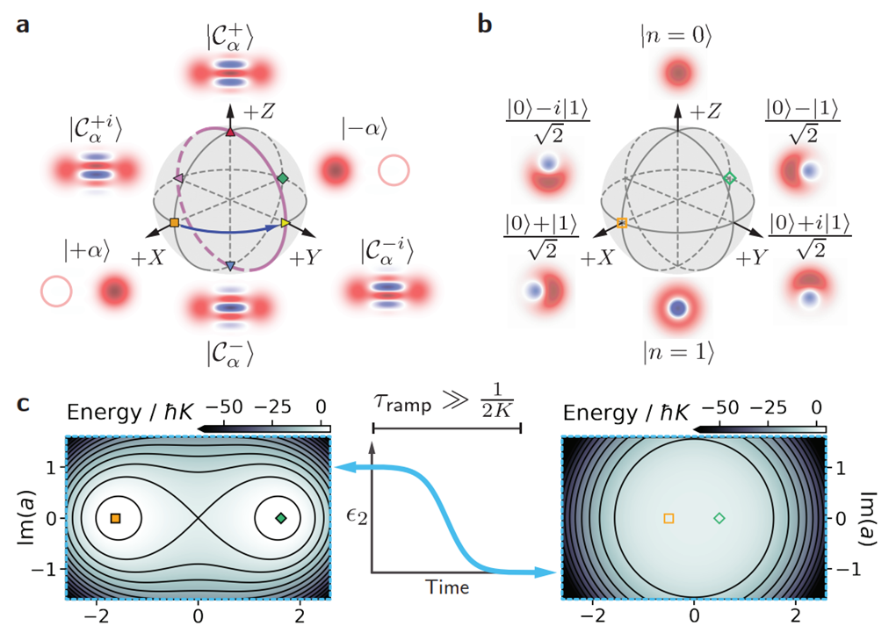

# Kerr-Cat qubit
*Author: Kevin Villegas Rosales*

_Demonstrated in QuLab, the laboratory of Prof. Michel Devoret, at Yale University. https://qulab.eng.yale.edu/_

_Demonstrated in the experiment of Rodrigo G. Cortiñas (https://www.linkedin.com/in/rodrigo-g-corti%C3%B1as-133a78164/)_

## The goal

In this use-case we show data related to the stabilization of a Kerr-Cat qubit with
a squeezing drive and three wave mixing.

## The device
The device that was used was as SNAIL with a planar resonator for readout, and
both of these inside of a 3D cavity.

## Kerr-cat qubit

The Kerr-cat Hamiltonian, in the SNAIL rotating frame, is the following, 

$\hat{H}_{cat}/\hbar = -K\hat{a}^{\dagger2}\hat{a}^{2} + \epsilon\_{2}(\hat{a}^{\dagger2}+\hat{a}^{2})$, (1) 

where $K$ is the Kerr-nonlinearity and $\epsilon\_{2}$ is the amplitude of the squeezing drive.
The simulated energy landscape can be seen in Fig. 1c (left figure). There are two local minima
separated by an energy barrier. The two coherent states existing in these minima are |$\alpha$> and
|$-\alpha$>, and the superposition of these coherent states form cat states. The Bloch sphere of this 
driven Hamiltonian can be seen in Fig. 1b. When there is no squeezing drive applied to the SNAIL, the
Hamiltonian is the one of a simple transmon that can encode the first two Fock states. The Bloch
sphere and simulated energy potential of the undriven Hamiltonian can be seen in Fig. 1a and 1c. Figure
1 appearing in this use-case is the identical Figure 1 appearing in Grimm and Frattini *et al.*, Nature **584**, 205 (2020) [1].
The caption in Fig. 1 was reproduced from Ref. [1].

**Figure 1**. **a**, Bloch sphere of the protected "Kerr-cat qubit" in the large-$\alpha$ limit [2]. The
states on all six cardinal points are labelled, indicated by markers and their Wigner function [3] phase-space
representations are sketched. Here, |$\pm$ $Z$ $\>$ = |$C^{\pm}\_{\alpha}$ $\>$ = (|+$\alpha$ $\>$ $\pm$ |-$\alpha$ $\>$)/$\sqrt{2}$
and |$\pm Y$ $\>$ = |$C^{\mp i}_{\alpha}$ $\>$ = (|$+\alpha$ $\>$ $\mp$ $i$|$-\alpha$ $\>$)/$\sqrt{2}$. The continuous $X(\theta)$ gate
and the discrete $Z(\pi/2)$ gate are shown by a purple circle and a blue arrow, respectively. **b**, Bloch sphere
of the single-photon "Fock qubit" shown for comparison with **a**. **c**, Energy dependence of equation (1) on classical
phase-space coordinates Re(a) and Im(a) for squeezing drive amplitudes $\epsilon\_{2}/2\pi$ = 17.75 MHz (left)
and $\epsilon\_{2}$ = 0 (right) with a sketch showing the adiabatic ramp of the drive over a time $\tau\_{ramp} >> 1/2K$. Black
lies are constant energy contours. The quadrature expectation values of the |$\pm X$ $\>$-states from **a**, **b** are 
indicated by their respective markers.

## Cat quadrature readout

Cat quadrature readout (cqr) is a Quantum non-Demolition (QND) technique to readout the Kerr-Cat qubit.
Thanks to the parametric process of the SNAIL a cqr pulse sent at $\omega_{resonator}$ - $\omega_{s}/2$ creates a
displacement in the readout resonator that we can measure. Figure 2a and 2b show the pulse sequence and the IQ-blobs
of the coherent states |$\alpha$> and |-$\alpha$>, respectively.

## Coherence times

## Coherence times while continuous measuring

## References

[1] A. Grimm
[2]
[3]
