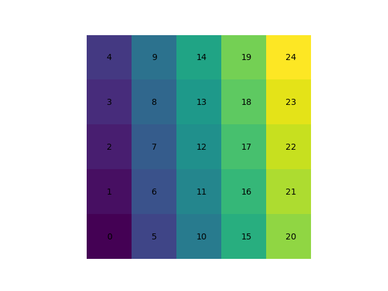
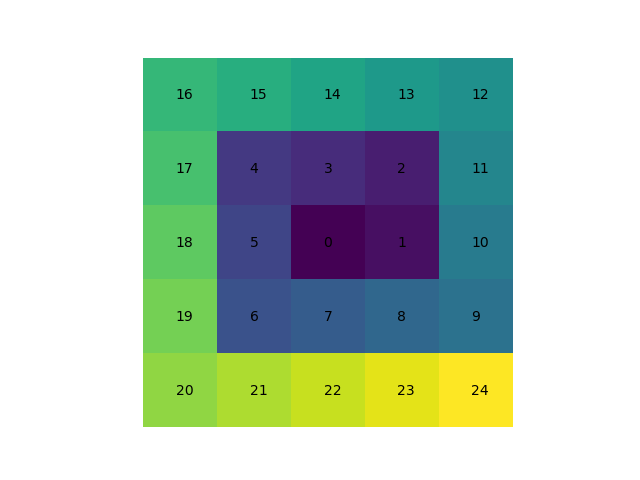

# Fast Two Dimensional Scans

### Motivation and Historical Context

Two dimensional scans over the voltage set to a pair gates has formed the backbone of quantum dot tuning for many years. In most cases such measurements are performed slowly by means rasta scan. Where a lab PC coordinates two instruments, a DAC to set voltages and an acquisition instrument to measure, by message passing. The message passing required for a single pixel is: 

1. Lab PC sends message to DAC to set voltage
2. DAC replies saying it has set voltage
3. Lab PC tells acquisition instrument to measure.
4. Acquisition card returns measured data. 

Typically this message passing and setting voltages takes on the order of 10ms, meaning that a 100x100 pixel scan would take over a minute. 

However, a small number of semiconductor groups around the world have demonstrated the ability to measure much faster by using an AWG to set the voltage. To my knowledge all attempts have relied on a pair of sawtooth waves, the period of one being a integer multiple of the other, to also perform a raster scan. 

Though this method I personally routinely performed 100x100 pixel scans in 5ms, where each pixel was measured for a total of 500ns. However, in doing so I discovered a flaw in the methodology, which I later then circumvented using the OPX. 

##### The Flaw in Rasta Scans

My setup for performing the fast measurements was to connect the AWG to the gates through the capacitive node of a bias tee. Thus, introducing a high pass filtering effect on the signals sent from the AWG. In our setup the time constant for this filtering effect was found to be approximately 1ms, orders of magnitude away from being an issue for qubit manipulation. 

However, for the fast scans it was quite prohibitive, as it place hard limits of the resolution and/or the time spent at each pixel. As period of the slower sawtooth was given by the time spend per pixel multiplied by the total number of pixels in the image.  When this period of a similar order of magnitude to the time constant of the filter we found the two dimensional scans where distorted and were difficult to interpret. It was possible, up to a point, to percompensate the slower sawtooth for the distortion of the high pass filter, allowing us to perform out our 100x100 scan with a time per pixel of 500ns meaning that the period of the slow sawtooth was 5ms. 

##### Moving Away From Rasta

The programability of the OPX made it possible to move away from Rasta scans, thus greatly avoiding this issue. Rather than Rasta scans we used a spiral pattern to navigate to every pixel in across the two dimensional window. For a scan of $N \times N$  pixels where time $\tau$ is spent at each pixel the slowest frequency needed for the spiral pattern is $f=2N/\tau$ whereas for a Rasta scan it was $f=N^2/\tau$ . Thus allowing much greater resolutions and/or time spent at each pixel before the high pass filtering effect becomes an issue. 

The ability to spend much longer at each pixel made it possible to run pulse sequences prior to measuring. So rather than measuring the always ground state, it was possible to excite metastable states, something which was invaluable to searching for spin physics. 

