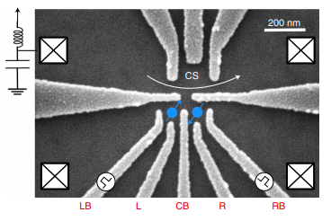

# Quantum Dots

The examples folder demonstrates some of the applications of the OPX towards measuring quantum dots. The experimental setup is: 



Where the OPX analogy input ports 1, 2 and 3 are connected to gates LB, RB, CSP respectively by means of bias tees. Analogy input port 4 and output port 1 are connected to the charge sensor matching circuit to facilitate RF charge sensing measurements. The reflected RF signal is amplified significantly before it is returned to the OPX. As such the `controllers` dictionary takes the form: 

```python
controllers = {
    "con1": {
        "type": "opx1",
        "analog_outputs": {
            1: {"offset": 0.0, 'filter': {'feedback': [], 'feedforward': [1]}},
            2: {"offset": 0.0, 'filter': {'feedback': [], 'feedforward': [1]}},
            3: {"offset": 0.0, 'filter': {'feedback': [], 'feedforward': [1]}},
            4: {"offset": 0.0, 'filter': {'feedback': [], 'feedforward': [1]}}
        },
        "digital_outputs": {},
        "analog_inputs": {
            1: {"offset": 0.0}
        },
    }
}
```

Where the digital filter is configured to perform not compensation on the waveforms, we will calibrate the filter compensation later. From here, our `elements` dictionary is 

```python
elements = {
    "LB": {
        "singleInput": {"port": ("con1", 1)},
        "hold_offset": {"duration": int(1e6)},
        "operations": {
            "jump": "jump"
            "ramp": "ramp"
        },
    },
    "RB": {
        "singleInput": {"port": ("con1", 2)},
        "hold_offset": {"duration": int(1e6)},
        "operations": {
            "jump": "jump", 
            "ramp": "ramp"
        },
    },
    "CSP": {
        "singleInput": {"port": ("con1", 3)},
        "hold_offset": {"duration": int(1e6)},
        "operations": {
            "jump": "jump"
            "ramp": "ramp"
        },
    },
    "rf": {
        "singleInput": {"port": ("con1", 4)},
        "time_of_flight": 180,
        "smearing": 0,
        "intermediate_frequency": 100e6,
        "outputs": 
        {"out1": ("con1", 1)},
        "operations": {
            "measure": "measure"
        },
    },
}
```

For the elements connected to gates we define the hold offset field to make the pulses sticky, so that the pulses are played additively, we define the hold_offset to be such that once a program is complete the outputs will be ramped to zero over the course of 1ms, avoiding any chance of damaging the device. Each of these elements have the operations `jump` and `ramp`, these operations, when played, will change the gate voltage - `jump` instantaneously changes the gate voltage then blocks the element for a certain duration, while `ramp` spends the full duration ramping the gate voltage. 

Finally, for the `rf` element the RF frequency is set to be 100MHz in the intermediate field while the time of flight is conservatively set to 180ns; The true time of flight will most certainly be greater than this but we will calibrate this correctly later in (). The `rf` element has one associated operation `measure` this element drives the matching circuit with an RF tone then measures the samples the reflection. 

Next the `pulse dictionary` where the truly define pulses associated with the operations discussed above.  

```python
pulses = {

    "ramp": {
        'operation': "control",
        'length': 100,
        "waveforms": {
            "single": "ramp"
        }
    },

    "jump": {
        "operation": "control",
        "length": 100,
        "waveforms": {"single": "jump"},
    },

    "measure": {
        "operation": "measurement",
        "length": 512,
        "waveforms": {"single": "measure"},
        "digital_marker": "ON",
        "integration_weights": {
            "integW1": "measure_I",
            "integW2": "measure_Q",
        },
    },
}
```

In this dictionary the `ramp` and `jump` are simple control pulses which play a single waveform. While `measure` is a measurement, meaning that along side playing its respective waveform it will sample to allow for the possibility of demodulation or integration when combined with the integration weights specified in the `integration_weight` dictionary. We define the `integration_weights` dictionary as 

```python
from .pulses import pulses

def get_length(pulse):
    return int(pulses.get(pulse).get('length') // 4)


integration_weights = {
    "measure_I": {"cosine": [1] * (get_length('measure')),
                  "sine": [0] * (get_length('measure'))},
                  
    "measure_Q": {"cosine": [0] * (get_length('measure')),
                  "sine": [1] * (get_length('measure'))}
}
```

Where we have define the helpful function `get_length` which looks up the length of the `measure` pulse then calculates how long the integration weights should be to exactly match the length of the pulse, so that if the user wants to change the pulse length they need only change it in one place. And finally the `waveform` dictionary is 

```python
import numpy as np

from .pulses import pulses

def get_length(pulse):
    return int(pulses.get(pulse).get('length'))

waveforms = {
    "jump": {"type": "constant", "sample": 0.5},
    "ramp": {"type": "arbitrary", "samples": np.linspace(0, 0.5, get_length('ramp'))},
    "measure": {"type": "constant", "sample": 0.01},
}
```

Where we have defined the `ramp` and `jump` pulses to have the an amplitude of 0.5V, the OPXs maximum. These pulses are then rescaled is many of the programs which make use of them. Again we have defined a helper function to automatically lookup the length. The amplitude of the measure pulse was chosen with explicit reference to the filters in the fridge so the right amplitude is incident on the sample. For safety in is never rescaled in any program. 

 

## Calibration Measurements

In the configuration files there are many values which are arbitrarily chosen, I will now outline introduce the programs used to choose measure these values. These programs are presented in the order which I implemented them in the lab: 

1. Time of flight
2. RF frequency calibration 
3. Filter characterisation and compensation

