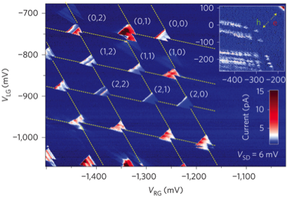
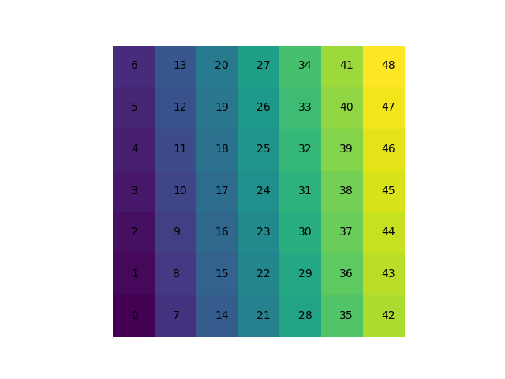
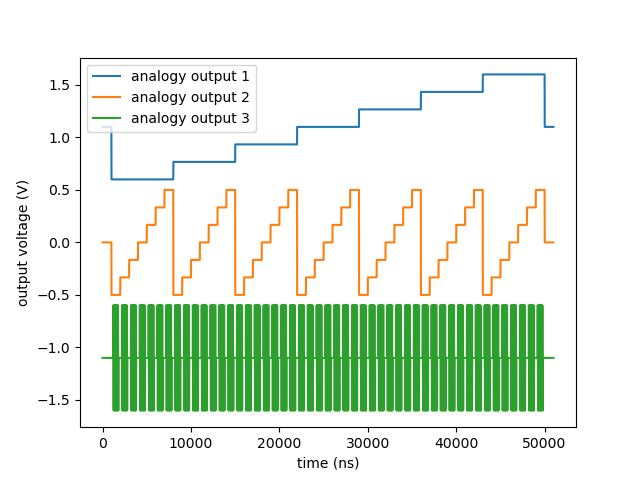
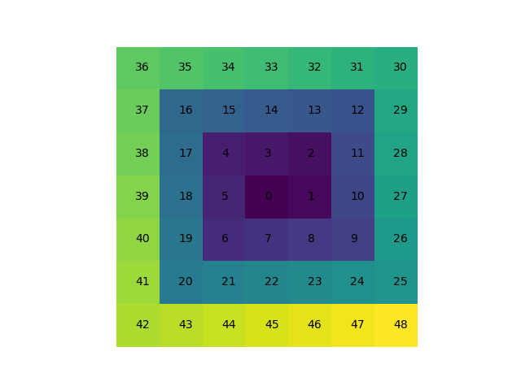
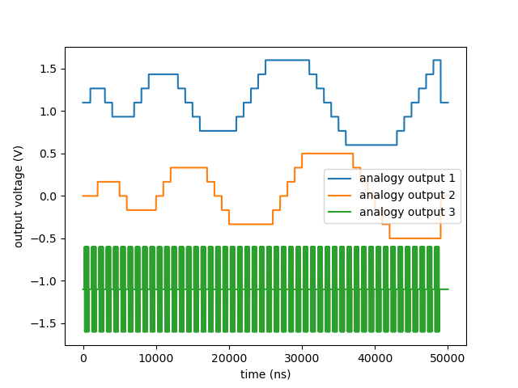

# Fast Two Dimensional Scans

This section contains a program to perform a fast two dimensional scan over a pair of gate voltages. Due to the flexibility of the OPX this scan is performed quite differently from how similar fast scans have been done in the past, with significant advantages. The most notable of which is the ability to interleave pulse sequences with the fast scan, a functionality which we found invaluable when searching for the $S-T_{-}$ avoided crossing, an indicative feature of spin physics. 

The structure of this section is: 

| File                 | Description                                                  |
| -------------------- | ------------------------------------------------------------ |
| `main_basic.py`      | A minimal example of using the program to perform a fast two-dimensional scan. With the subsequent data reshaping. |
| `main_pulse.py`      | A example of how to interleave a pulse sequence with the fast two-dimensional scan. |
| `main_video_mode.py` | A example of using the program to continuously measure the state of the device, such that the device state is displayed as a video. |

The text below gives some historical context how such two dimensional scans have been performed. 

1. It outlines how they can be performed slowly using standard semiconducting device instruments such as an IVVI DAC. 
2. Then outlines how an AWG can be used to greatly increase the speed at which such measurements can be taken, reducing measurement time by at least four orders of magnitude. 
3. However, such a speed increase is not without its limitations, with in this case is due to the high pass filtering effect introduced by a bias tee. 
4. The implications of this filtering are discussed, then demonstrate how with the OPX it is possible to avoid it. 

### Motivation and Historical Context

Two dimensional scans over the voltage set to a pair gates has formed the backbone of quantum dot tuning for many years. In most cases such measurements are performed slowly by means rasta scan. Where a lab PC coordinates two instruments, a DAC to set voltages and an acquisition instrument to measure, by message passing. The message passing required for a single pixel is: 

1. Lab PC sends message to DAC to set voltage
2. DAC replies saying it has set voltage
3. Lab PC tells acquisition instrument to measure.
4. Acquisition card returns measured data. 

Typically this message passing and setting voltages takes on the order of 10ms, meaning that a 100x100 pixel scan would take over a minute. 

Image taken from [Quantum Transport In Semiconductor Nanowires.](https://homepages.spa.umn.edu/~vpribiag/researchPages/Quantum-Transport-in-Semiconductor-Nanowires.php)

However, a small number of semiconductor groups around the world have demonstrated the ability to measure much faster by using an AWG to set the voltage. To my knowledge all attempts have relied on a pair of sawtooth waves, the period of one being a integer multiple of the other, to also perform a raster scan. The raster pattern and the waveform necessary to navigate across it are shown below for a 7x7 image, with the measurement time per pixel being 1us. 

|  |  |
| ------------------------------------------ | -------------------------------------------------- |

In the above images, the voltage from analogy output 1 controls the x coordinate in the image, and analogy output 2 controls the y. Analogy output 3 in responsible for creating the RF tone for measurement. The output voltages have been offset by 1.1V for clarity. 

Though this method I personally routinely performed 100x100 pixel scans in 5ms, where each pixel was measured for a total of 500ns. However, in doing so I discovered a flaw in the methodology, which I later then circumvented using the OPX. 

##### The Flaw in Rasta Scans

My setup for performing the fast measurements was to connect the AWG to the gates through the capacitive node of a bias tee. Thus, introducing a high pass filtering effect on the signals sent from the AWG. In our setup the time constant for this filtering effect was found to be approximately 1ms, orders of magnitude away from being an issue for qubit manipulation. 

However, for the fast scans it was quite prohibitive, as it place hard limits of the resolution and/or the time spent at each pixel. As period of the slower sawtooth was given by the time spend per pixel multiplied by the total number of pixels in the image.  When this period of a similar order of magnitude to the time constant of the filter we found the two dimensional scans where distorted and were difficult to interpret. It was possible, up to a point, to percompensate the slower sawtooth for the distortion of the high pass filter, allowing us to perform out our 100x100 scan with a time per pixel of 1us meaning that the period of the slow sawtooth was 10ms. 

##### Moving Away From Rasta

The programability of the OPX made it possible to move away from Rasta scans, thus greatly avoiding this issue. Rather than Rasta scans we used a spiral pattern to navigate to every pixel in across the two dimensional window. 

|  |  |
| ------------------------------------------ | -------------------------------------------------- |

For a scan of $N \times N$  pixels where time $\tau$ is spent at each pixel the slowest frequency needed for the spiral pattern is $f=2N/\tau$ whereas for a Rasta scan it was $f=N^2/\tau$ . Thus allowing much greater resolutions and/or time spent at each pixel before the high pass filtering effect becomes an issue. Shown below is the effect of a high pass filter with a time constant of 200us on the waveforms needed to create 101x101 raster and spiral scans with a measurement time of 1us. 

|  |  |
| :----------------------------------------------------------: | :----------------------------------------------------------: |
|  |  |

The ability to spend much longer at each pixel made it possible to run pulse sequences prior to measuring. So rather than measuring the always ground state, it was possible to excite metastable states, something which was invaluable to searching for spin physics. 

