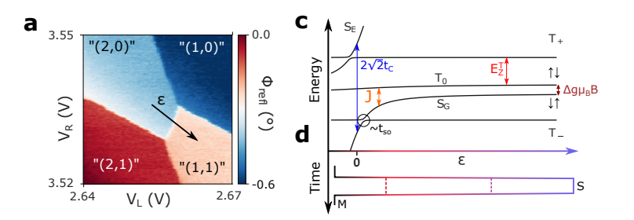
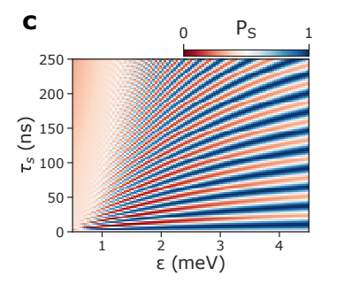

## Rabi 

A rabi pulse sequence for a singlet-triplet qubit can be understood as: 

1. Pulse deep into the (2, 0) charge state to initialise the spin singlet state. 
2. Jump across the (2, 0)-(1, 1) charge transition to a detuning of $\epsilon$ (mV) in the (1, 1) charge state and stay there for time $\tau_s$ (ns). 
3. Jump to the measurement point and measure. 

The Hamiltonian for the $T_0-S_G$ sub-system is: 
$$
H = \begin{pmatrix}
-J(\epsilon) & \Delta g \mu_B B / 2  \\
\Delta g \mu_B B / 2 & 0
\end{pmatrix}
$$
Where exchange coupling $J(\epsilon)$ takes the is a function of the detuning and the tunnel coupling $t_c$ such that
$$
J(\epsilon) = \sqrt{\epsilon^2 / 4 + t_c ^2} - \epsilon / 2
$$
Where for large detunings $J(\epsilon) << \Delta g \mu_B B / 2$  such that the spin state will rotate about approximately the $\sigma_x$ axis. Therefore, by varying the time $\tau$ spent in the (1, 1) charge state it is possible to see Rabi Oscillations. For smaller detunings, $\epsilon$, the system will rotate about about an axis an angle $\theta(\epsilon) =\arctan( \Delta g \mu_B B / J(\epsilon))$ from the $Z$ axis. 

Therefore, a pulse sequence which varies both $\tau_s $ and $\epsilon $

Figures adapted from [A singlet triplet hole spin qubit in planar Ge](https://arxiv.org/pdf/2011.13755.pdf)
